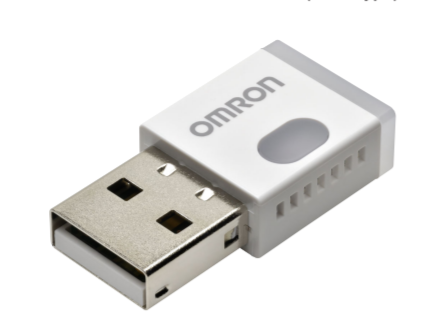

# Azure Omron IoT Example

This repository contains multiple exemplary .NET/C# Projects for getting started on the Azure IoT Platform with an Omron Enviromental Sensor 2JCIE-BU01

# Project Overview

* [Omron.2JCIE-BU01](Omron.2JCIE-BU01/README.md)
  > A library project, which allows reading and writing to the 2JCIE-BU01 Sensor via a USB Serial connection. While not every write/read method is implemented, reading sensor data and setting the LED Color is possible.

* [Omron.2JCIE-BU01.DeviceClient](Omron.2JCIE-BU01.DeviceClient/README.md)
  > A console project, which connects to the IoT Hub using a Device Provision Service. It then sends (message and file upload) sensor telemetry in a configurable interval, waits for streaming requests and allows direct methods to be called.

* [Omron.2JCIE-BU01.Example](Omron.2JCIE-BU01.Example/README.md)
  > A console project for testing the successful connection to the 2JCIE-BU01. Prints the sensor data at a fixed interval

* [Omron.2JCIE-BU01.StreamService](Omron.2JCIE-BU01.StreamService/README.md)
  > A console project for opening a websocket-based streaming channel to the `DeviceClient` project. It is able to both receive and send messages from both parties.

# Getting Started Guides

* [Development Setup](docs/guides/dev-setup.md)
* [Setup your IoT Services](docs/guides/iot-setup.md)
* [Run Omron.2JCIE-BU01.DeviceClient on IoT Hub](docs/guides/device-client-iothub.md)
* [Run Omron.2JCIE-BU01.DeviceClient on IoT Central](docs/guides/device-client-iotcentral.md)
