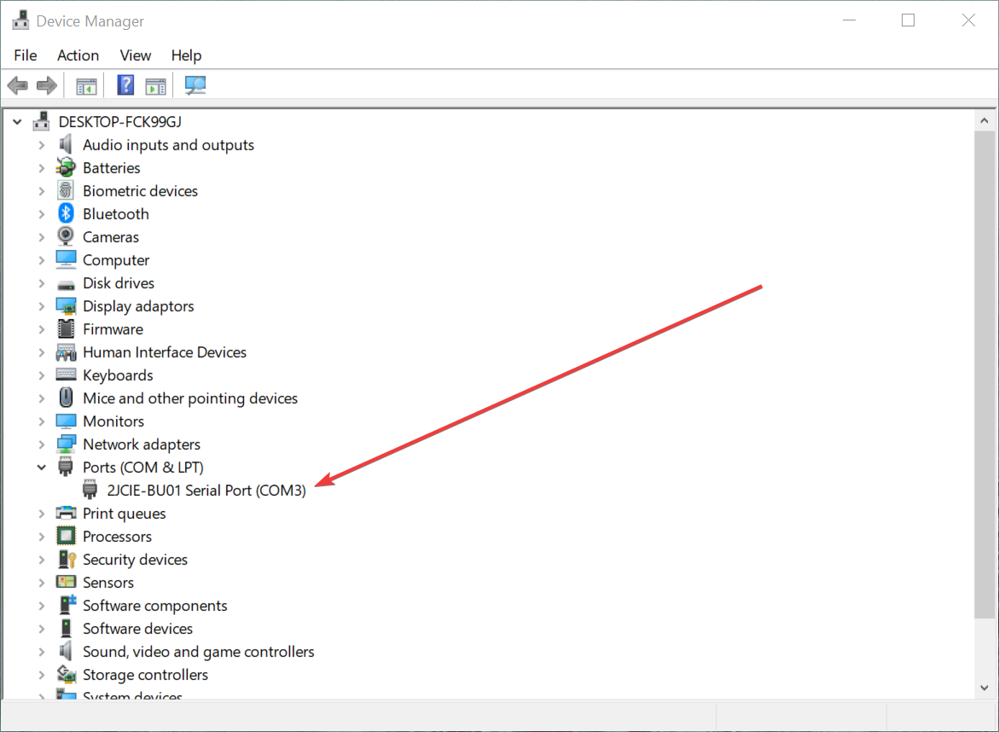

# Development Setup

## Requirements

* dotnet installed (>= 3.1.100)
* (optional) VSCode

## Driver Installation

* Visit [Omron 2JCIE-BU01 Downloads](https://www.components.omron.com/sensors/iot-sensors/enviorment-sensors/2jcie_bu01_usb-driver/download) and follow the instruction manual.
* Confirm that your sensor is detected as a serial device:

## Environment Files

* Make a copy of `.env.template` and save as `.env`

## (optional) VSCode IoT Tools

* Open the Extension Management Panel (`CTRL + SHIFT + X`)
* Install `Azure IoT Tools`
* Login with your Azure account at the bottom of the window
