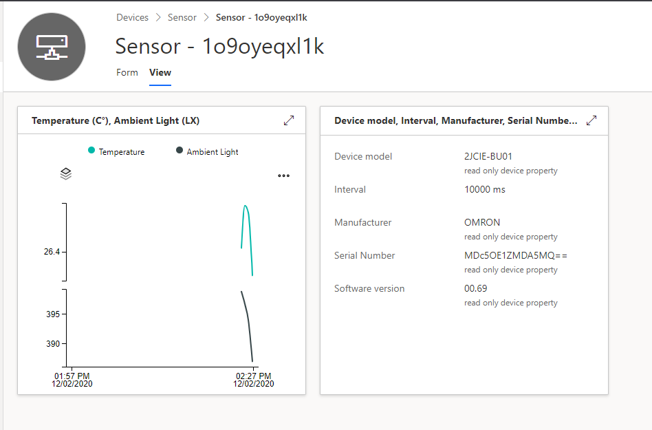

# Omron.2JCIE-BU01.DeviceClient on IoT Central

In this section we will connect our local running code to the an IoT Central.

## Steps

1. Open your IoT Central App (If not yet created, you can deploy it via [Azure IoT Central](https://apps.azureiotcentral.com/))
1. Open `Device Template` --> `New` and create a new `IoT Device`
1. Select `Import Capability Model` and select the file `Omron.2JCIE-BU01.DeviceClient/Omron_2JCIE_BU01.capabilitymodel.json`
1. Create some views for the device (TODO: Not automatable yet)
1. Publish the Template
1. At `Devices` -> `YOUR_DEVICE_TEMPLATE`, add a new device and visit it's page after creation
1. Press `Connect` in the top right, copy the values to your `.env` file. Make sure to put `ENABLE_FILE_UPLOAD=false` and `ENABLE_FILE_STREAMING=false`
1. Start `Omron.2JCIE-BU01.DeviceClient` and see data appearing in IoT Central

