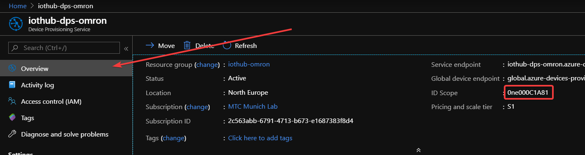

# Omron.2JCIE-BU01.DeviceClient on IoT Hub

In this section we will connect our local running code to the already setup IoT Hub and make sure we're receiving data from it.

## Steps

1. Create an **Individual Enrollment** using **Symmetric Keys** inside your Device Provisioning Service (DPS) using the [following guide](https://docs.microsoft.com/en-us/azure/iot-dps/how-to-manage-enrollments)
1. Fill the following variables in your `.env` file:
  * `REGISTRATION_ID`
    > The registration ID of your individual enrollment you just created
  * `ID_SCOPE`
    > Can be found in the `Overview` tab of your DPS Panel.
    
  * `INDIVIDUAL_ENROLLMENT_PRIMARY_KEY` & `INDIVIDUAL_ENROLLMENT_SECONDARY_KEY`
    > Can be found by clicking on your individual enrollment you just created.
  * `ENABLE_FILE_UPLOAD` & `ENABLE_STREAMING`
    > set both variables to `true`

3. Using VSCode, start the project `Omron.2JCIE-BU01.DeviceClient`
3. Continue with one the following guides:
  * [Verify sensor telemetry](iothub/telemetry.md)
  * [Update device properties](iothub/properties.md)
  * [Invoke device methods](iothub/methods.md)
  * [Verify file uploads](iothub/uploads.md)
  * [Connect to device stream](iothub/device-stream.md)
