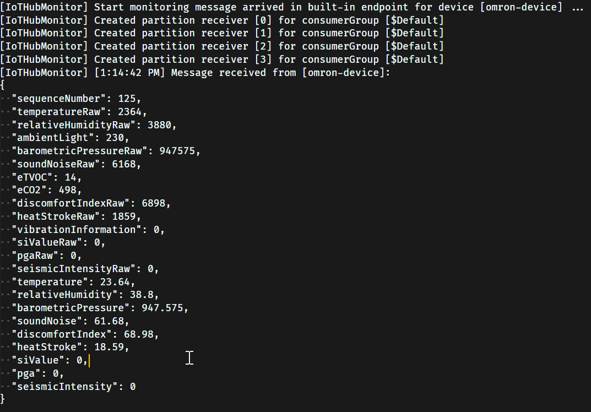

# Verify sensor telemetry

The example code sends sensor data at a configurable interval. Let's check that we actually get the data!

## Steps

1. (Only required once) Using VSCode, run `Select IoT Hub` via `CTRL + SHIFT + P` and select your IoT Hub
1. On the left side panel `Azure IoT Hub`, find your device and right click -> `Start Monitoring Built-In Event Endpoint`
1. Verify sensor data is sent:

[Go Back](../device-client-iothub.md)
