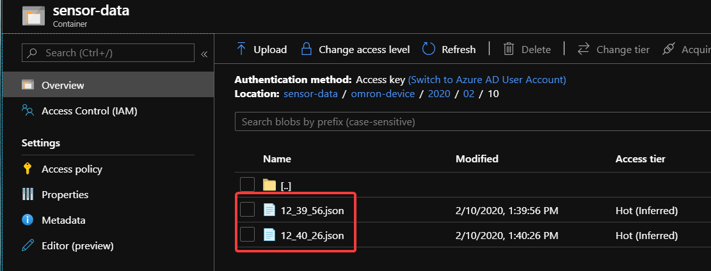

# Verify file uploads

In this step we will attach a storage account to your IoT Hub and verify, that the device uploads data to this account.

## Steps

1. Using the Azure portal, create a new `Storage Account` in your IoT Hub Resource Group
1. In your Azure IoT Hub Portal, under `File Upload`, select your Storage Account and create a new container.
1. Save
1. After some time, check in your `Storage Account` Portal if files have been created.

[Go Back](../device-client-iothub.md)
